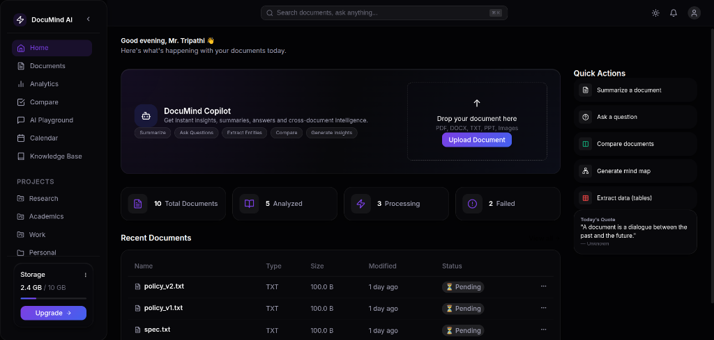
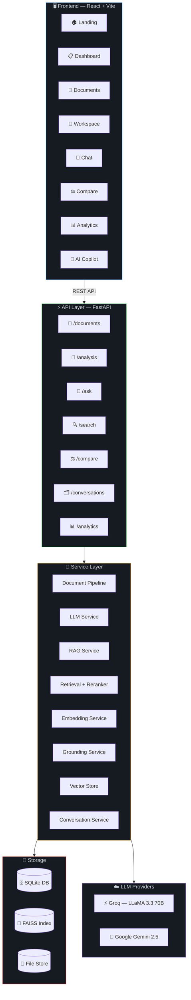
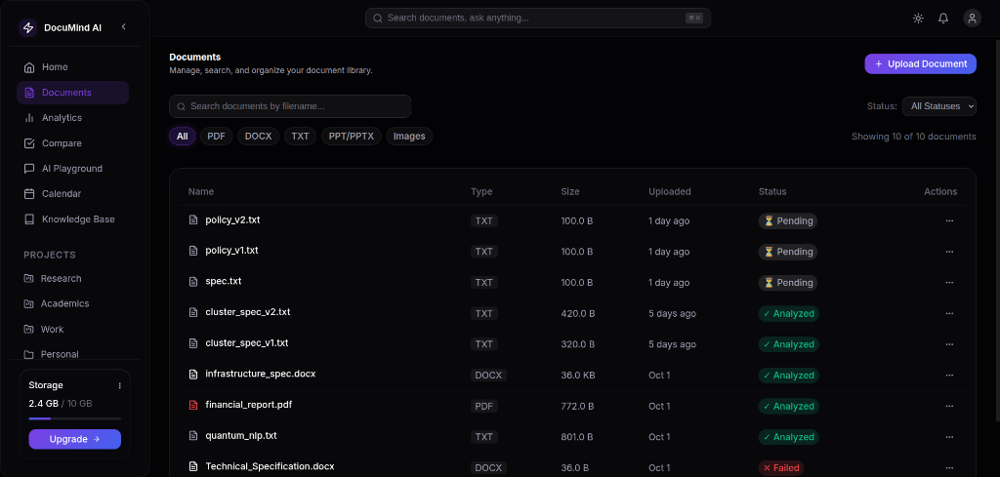
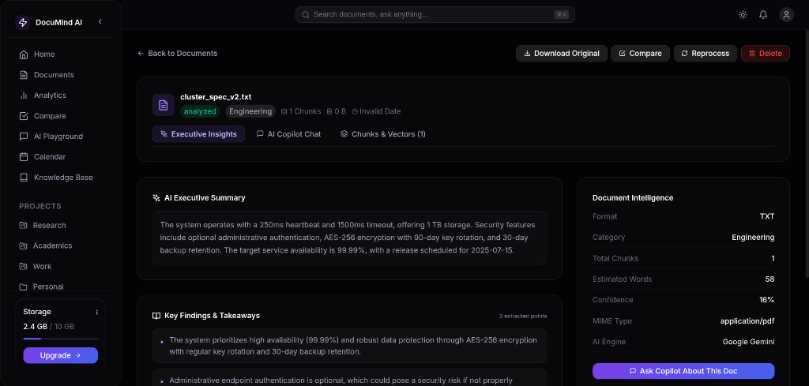
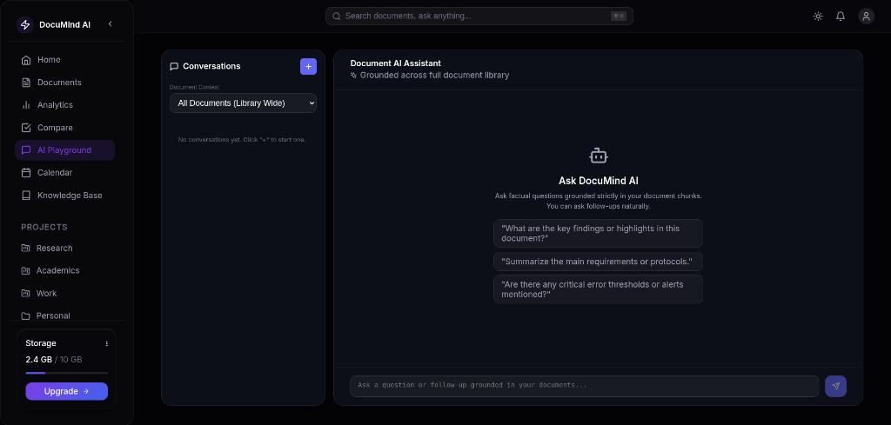
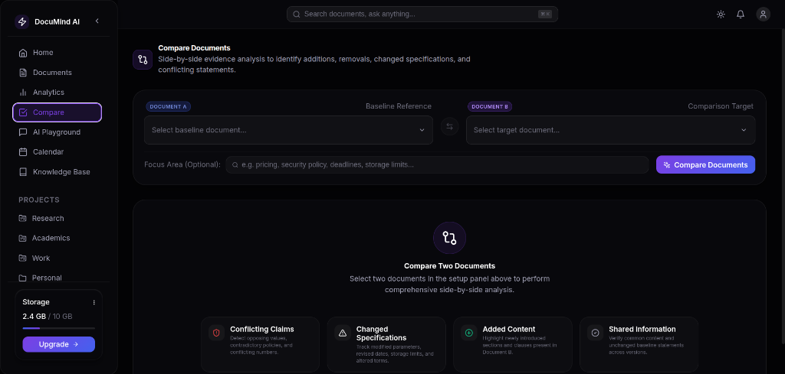
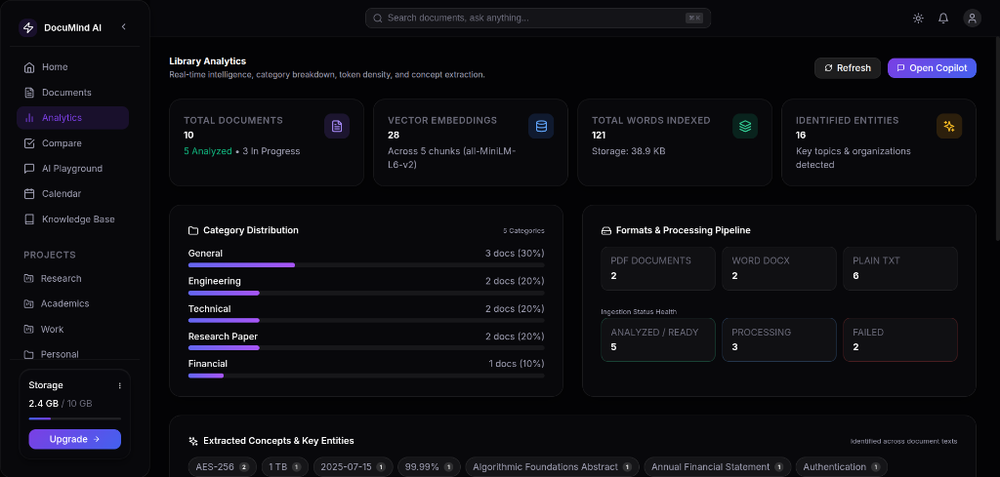

<!-- ╔══════════════════════════════════════════════════════════════════╗ -->
<!-- ║                     D O C U M I N D                             ║ -->
<!-- ║              AI-Powered Document Intelligence                    ║ -->
<!-- ╚══════════════════════════════════════════════════════════════════╝ -->

<!-- Animated gradient header -->
<div align="center">


<!-- Animated typing effect -->
<a href="https://github.com/VasudevTripathi/DocuMind">
  
</a>

<br />

<!-- Primary badges row -->
<p>
  <a href="https://python.org"></a>
  
  
  
  
</p>

<!-- Secondary badges row -->
<p>
  <a href="LICENSE"></a>
  <a href="https://github.com/VasudevTripathi/DocuMind/stargazers"></a>
  <a href="https://github.com/VasudevTripathi/DocuMind/network/members"></a>
  <a href="https://github.com/VasudevTripathi/DocuMind/issues"></a>
  <a href="https://github.com/VasudevTripathi/DocuMind/pulls"></a>
  
  
</p>

<br />

<!-- Hero description -->
<table>
<tr>
<td>

> **DocuMind** is a full-stack AI document intelligence platform that combines **RAG-powered Q&A**, **vector search**, **document comparison**, and **analytics** — all wrapped in a beautiful React frontend with Framer Motion animations and a glassmorphic design system.

</td>
</tr>
</table>

<a href="assets/screenshots/dashboard.png">
  
</a>

<br /><br />

<!-- Quick nav pills -->
<p>
  <a href="#-features"></a>
  <a href="#-architecture"></a>
  <a href="#-quick-start"></a>
  <a href="#-api-reference"></a>
  <a href="#-roadmap"></a>
  <a href="#-contributing"></a>
</p>

</div>

<!-- Wave separator -->


<br />

<!-- ════════════════════════════════════════════════════════════════ -->
<!-- FEATURES                                                        -->
<!-- ════════════════════════════════════════════════════════════════ -->

<div align="center">
  
</div>

<br />

<div align="center">
<table>
<tr>
<td align="center" width="33%">


**Smart Document Ingestion**

Drag-and-drop **PDF** & **DOCX** files. DocuMind auto-parses, chunks, and indexes every page — ready for AI in seconds.

</td>
<td align="center" width="33%">


**Deep AI Insights**

One-click summaries, theme extraction, and sentiment analysis powered by **LLaMA 3.3 70B** via Groq or **Google Gemini**.

</td>
<td align="center" width="33%">


**Conversational Q&A**

Ask anything. RAG retrieval + reranking + grounded citations ensure every answer is traceable to its source passage.

</td>
</tr>
<tr>
<td align="center" width="33%">


**Semantic Search**

FAISS-powered similarity search with **SentenceTransformer** embeddings finds conceptually relevant content — not just keyword matches.

</td>
<td align="center" width="33%">


**Document Comparison**

AI-driven side-by-side comparison highlights shared themes, unique insights, contradictions, and structural differences.

</td>
<td align="center" width="33%">


**Real-Time Analytics**

Interactive **Recharts** dashboard visualizes upload trends, document stats, and AI usage patterns at a glance.

</td>
</tr>
</table>
</div>

<br />

<!-- ════════════════════════════════════════════════════════════════ -->
<!-- WHY DOCUMIND                                                    -->
<!-- ════════════════════════════════════════════════════════════════ -->

<div align="center">
  
</div>

<br />

<div align="center">

```
 ╭────────────────────────────────────────────────────────────────────────╮
 │                                                                        │
 │   🧩  Full RAG Pipeline    Chunk → Embed → Index → Retrieve → Answer  │
 │   ⚡  Blazing Fast         FastAPI async + Vite HMR = <1s feedback    │
 │   🔌  Multi-LLM Support   Groq (LLaMA 3.3) ↔ Google Gemini           │
 │   🎯  Grounded Answers    Every response cites exact source passages   │
 │   🛡️  Local Embeddings    SentenceTransformer — your data stays local │
 │   🎨  Premium UX          Framer Motion + Lucide + Glassmorphism      │
 │   📈  Built-in Analytics  Track usage, trends, and document insights   │
 │   🔄  Live Conversations  Persistent chat threads with full history    │
 │                                                                        │
 ╰────────────────────────────────────────────────────────────────────────╯
```

</div>

<br />

<!-- ════════════════════════════════════════════════════════════════ -->
<!-- TECH STACK                                                      -->
<!-- ════════════════════════════════════════════════════════════════ -->

<div align="center">
  

<br /><br />

<!-- Tech stack icons using skillicons.dev -->
<a href="#"></a>

<br /><br />

| Layer | Technologies |
|:---:|---|
| **🖥️ Frontend** | `React 18` · `Vite 5` · `React Router 6` · `TanStack Query` · `Framer Motion` · `Recharts` · `Lucide React` · `react-markdown` |
| **⚙️ Backend** | `Python 3.11+` · `FastAPI` · `SQLAlchemy 2.0` · `Pydantic v2` · `Uvicorn` · `python-multipart` |
| **🧠 AI / ML** | `Groq (LLaMA 3.3 70B)` · `Google Gemini 2.5` · `SentenceTransformers` · `FAISS` · `scikit-learn` |
| **💾 Data** | `SQLite` · `FAISS Vector Store` · `PyPDF` · `python-docx` · `pandas` · `numpy` |

</div>

<br />

<!-- ════════════════════════════════════════════════════════════════ -->
<!-- ARCHITECTURE                                                    -->
<!-- ════════════════════════════════════════════════════════════════ -->

<div align="center">
  
</div>

<br />



<br />

<details>
<summary><b>📐 Detailed Data Flow (click to expand)</b></summary>
<br />

```
                    ┌─────────────────────────────┐
                    │      User uploads a PDF      │
                    └──────────────┬──────────────┘
                                   │
                    ┌──────────────▼──────────────┐
                    │    Document Parser (PyPDF)    │
                    │    Extracts raw text content  │
                    └──────────────┬──────────────┘
                                   │
                    ┌──────────────▼──────────────┐
                    │   Chunker (600-word chunks)   │
                    │   with 80-word overlap        │
                    └──────────────┬──────────────┘
                                   │
              ┌────────────────────┼────────────────────┐
              │                    │                     │
   ┌──────────▼────────┐  ┌───────▼───────┐  ┌─────────▼────────┐
   │  SQLite Database   │  │  Embedding    │  │  LLM Analysis    │
   │  (metadata +       │  │  Service      │  │  (summary +      │
   │   chunk text)      │  │  (MiniLM-L6)  │  │   key insights)  │
   └───────────────────┘  └───────┬───────┘  └──────────────────┘
                                   │
                          ┌────────▼────────┐
                          │   FAISS Index    │
                          │  (vector store)  │
                          └────────┬────────┘
                                   │
                    ┌──────────────▼──────────────┐
                    │  User asks a question (RAG)  │
                    └──────────────┬──────────────┘
                                   │
              ┌────────────────────┼────────────────────┐
              │                    │                     │
   ┌──────────▼────────┐  ┌───────▼───────┐  ┌─────────▼────────┐
   │  Query Embedding   │  │  FAISS        │  │  Reranker         │
   │  (same MiniLM)     │  │  Retrieval    │  │  (relevance       │
   │                     │  │  (top-k)     │  │   scoring)        │
   └───────────────────┘  └──────────────┘  └─────────┬────────┘
                                                       │
                                            ┌──────────▼──────────┐
                                            │  Grounding Service   │
                                            │  (cite sources)      │
                                            └──────────┬──────────┘
                                                       │
                                            ┌──────────▼──────────┐
                                            │   LLM Generation     │
                                            │   (grounded answer)  │
                                            └─────────────────────┘
```

</details>

<br />

<!-- ════════════════════════════════════════════════════════════════ -->
<!-- SCREENSHOTS                                                     -->
<!-- ════════════════════════════════════════════════════════════════ -->

<div align="center">
  
</div>

<br />

<div align="center">

<table>
<tr>
<td width="50%" align="center">

<a href="assets/screenshots/dashboard.png">
  
</a>
<br /><br />

<p align="center"><sub><b>Central Dashboard</b> — Quick actions, document dropzone & live stats overview</sub></p>

</td>
<td width="50%" align="center">

<a href="assets/screenshots/documents.png">
  
</a>
<br /><br />

<p align="center"><sub><b>Document Library</b> — Multi-format filter (PDF, DOCX, TXT), search & processing status</sub></p>

</td>
</tr>
<tr>
<td width="50%" align="center">

<a href="assets/screenshots/workspace.png">
  
</a>
<br /><br />

<p align="center"><sub><b>Document Workspace</b> — AI executive summary, key findings, document intelligence & Copilot chat</sub></p>

</td>
<td width="50%" align="center">

<a href="assets/screenshots/chat.png">
  
</a>
<br /><br />

<p align="center"><sub><b>AI Playground</b> — Multi-document conversational assistant grounded across your library</sub></p>

</td>
</tr>
<tr>
<td width="50%" align="center">

<a href="assets/screenshots/compare.png">
  
</a>
<br /><br />

<p align="center"><sub><b>Document Comparison</b> — Cross-document diffing for conflicting claims, changed specs & additions</sub></p>

</td>
<td width="50%" align="center">

<a href="assets/screenshots/analytics.png">
  
</a>
<br /><br />

<p align="center"><sub><b>Library Analytics</b> — Vector embeddings count, category breakdown & processing pipeline health</sub></p>

</td>
</tr>
</table>

</div>

<br />

<!-- ════════════════════════════════════════════════════════════════ -->
<!-- QUICK START                                                     -->
<!-- ════════════════════════════════════════════════════════════════ -->

<div align="center">
  
</div>

<br />

### 📋 Prerequisites

<table>
<tr>
<td>

| Requirement | Version |
|---|---|
|  | `3.11+` |
|  | `18+` |
|  | Required |

</td>
<td>

> 💡 **Get a free Groq API key** at [console.groq.com](https://console.groq.com)
>
> 💡 **Get a Gemini API key** at [aistudio.google.com](https://aistudio.google.com)

</td>
</tr>
</table>

---

### Step 1 · Clone the Repository

```bash
git clone https://github.com/VasudevTripathi/DocuMind.git
cd DocuMind
```

---

### Step 2 · Backend Setup (One-time)

```bash
cd backend

# Create & activate virtual environment
python -m venv .venv
source .venv/bin/activate          # macOS / Linux
# .venv\Scripts\activate           # Windows

# Install dependencies
pip install -r requirements.txt
```

---

### Step 3 · Configure Environment (One-time)

Copy the template using `-n` (no-clobber) so you never accidentally overwrite existing keys:

```bash
cp -n .env.example .env
```

> [!NOTE]
> Environment setup and package installation are **one-time steps**. Never run raw `cp .env.example .env` again after entering your keys, as it will reset them to defaults.

Open `backend/.env` and set your API keys:

```ini
# ── App Config ─────────────────────────────────────────────────
APP_NAME=DocuMind AI
DATABASE_URL=sqlite:///./data/db/documind.db
UPLOAD_DIR=./data/uploads
MAX_UPLOAD_SIZE_MB=50
FRONTEND_URL=http://localhost:5173

# ── LLM Provider ──────────────────────────────────────────────
LLM_PROVIDER=groq                           # "groq" or "gemini"
GROQ_API_KEY=gsk_your_key_here              # 🔑 Set your Groq API key
GROQ_MODEL=llama-3.3-70b-versatile

# ── Optional: Gemini ──────────────────────────────────────────
GEMINI_API_KEY=your_gemini_key_here          # 🔑 Set your Gemini API key
GEMINI_MODEL=gemini-2.5-flash

# ── Embeddings & Vector Store (runs locally) ──────────────────
EMBEDDING_MODEL=sentence-transformers/all-MiniLM-L6-v2
VECTOR_STORE_DIR=./data/vector_store

# ── RAG Tuning ────────────────────────────────────────────────
RAG_CHUNK_SIZE_WORDS=600
RAG_CHUNK_OVERLAP_WORDS=80
RAG_MAX_CONTEXT_WORDS=2500
```

---

### Step 4 · Launch the Backend

You can launch using the automated startup script (which protects your `.env` and activates your environment automatically):

```bash
# Option A: One-click safe startup script (Recommended)
./start.sh
```

Or run Uvicorn directly:

```bash
# Option B: Direct command
source .venv/bin/activate
uvicorn app.main:app --reload --port 8000
```

<div align="center">

> 🟢 API running at **http://localhost:8000** — Swagger docs at [/docs](http://localhost:8000/docs)

</div>

---

### Step 5 · Launch the Frontend

```bash
cd ../frontend

npm install
npm run dev
```

<div align="center">

> 🟢 App running at **http://localhost:5173** — Start uploading documents! 🎉

</div>

<br />

<!-- ════════════════════════════════════════════════════════════════ -->
<!-- API REFERENCE                                                   -->
<!-- ════════════════════════════════════════════════════════════════ -->

<div align="center">
  
</div>

<br />

All endpoints are served under `/api`. Full interactive docs available at **`/docs`** (Swagger UI).

<div align="center">

| | Method | Endpoint | Description |
|:---:|:---:|---|---|
| 💚 | `GET` | `/api/health` | Health check & status |
| 📤 | `POST` | `/api/documents/upload` | Upload a document (PDF / DOCX) |
| 📋 | `GET` | `/api/documents` | List all documents |
| 📄 | `GET` | `/api/documents/{id}` | Get document details & metadata |
| 🗑️ | `DELETE` | `/api/documents/{id}` | Delete a document & its vectors |
| 🔬 | `POST` | `/api/analysis/{id}/analyze` | Run AI analysis on a document |
| 💬 | `POST` | `/api/ask` | Ask a question (RAG-powered Q&A) |
| 🔍 | `POST` | `/api/search` | Semantic search across documents |
| ⚖️ | `POST` | `/api/compare` | Compare two documents |
| 🗂️ | `GET` | `/api/conversations` | List conversation threads |
| 💬 | `GET` | `/api/conversations/{id}` | Get conversation history |
| 📊 | `GET` | `/api/analytics/overview` | Analytics & usage metrics |

</div>

<br />

<details>
<summary><b>📝 Example: Upload & Analyze a Document (click to expand)</b></summary>
<br />

```bash
# Upload a PDF
curl -X POST http://localhost:8000/api/documents/upload \
  -F "file=@my_report.pdf"

# Response → { "id": 1, "filename": "my_report.pdf", "status": "processed", ... }

# Run AI analysis
curl -X POST http://localhost:8000/api/analysis/1/analyze

# Ask a question
curl -X POST http://localhost:8000/api/ask \
  -H "Content-Type: application/json" \
  -d '{"question": "What are the key findings?", "document_id": 1}'
```

</details>

<br />

<!-- ════════════════════════════════════════════════════════════════ -->
<!-- FOLDER STRUCTURE                                                -->
<!-- ════════════════════════════════════════════════════════════════ -->

<div align="center">
  
</div>

<br />

```
DocuMind/
│
├── 🔧 backend/
│   ├── app/
│   │   ├── api/                    # 🌐 Route handlers
│   │   │   ├── documents.py        #     Upload, list, delete
│   │   │   ├── analysis.py         #     AI analysis endpoints
│   │   │   ├── ask.py              #     RAG Q&A
│   │   │   ├── search.py           #     Semantic search
│   │   │   ├── compare.py          #     Document comparison
│   │   │   ├── conversations.py    #     Chat history
│   │   │   ├── analytics.py        #     Usage analytics
│   │   │   └── health.py           #     Health check
│   │   ├── core/                   # ⚙️ Config & database setup
│   │   ├── models/                 # 📦 SQLAlchemy ORM models
│   │   ├── schemas/                # 📐 Pydantic request/response schemas
│   │   ├── services/               # 🧠 Business logic layer
│   │   │   ├── document_pipeline.py#     End-to-end ingestion
│   │   │   ├── llm_service.py      #     LLM orchestration
│   │   │   ├── llm_provider.py     #     Groq & Gemini adapters
│   │   │   ├── rag_service.py      #     RAG orchestration
│   │   │   ├── retrieval_service.py#     Chunk retrieval
│   │   │   ├── embedding_service.py#     SentenceTransformer
│   │   │   ├── vector_store.py     #     FAISS operations
│   │   │   ├── reranker.py         #     Result reranking
│   │   │   ├── grounding_service.py#     Source citation
│   │   │   └── ...
│   │   ├── ml/                     # 🤖 ML model training & prediction
│   │   └── evaluation/             # 📊 RAG evaluation metrics
│   ├── data/                       # 💾 Uploads, DB, vector store
│   ├── scripts/                    # 🔨 Utility scripts
│   ├── tests/                      # 🧪 Pytest test suite
│   ├── requirements.txt
│   ├── start.sh                # 🚀 Safe startup script
│   └── .env.example
│
├── 🎨 frontend/
│   ├── src/
│   │   ├── components/             # 🧩 Reusable UI components
│   │   │   ├── layout/             #     AppShell, navigation
│   │   │   ├── ui/                 #     MarkdownRenderer, shared UI
│   │   │   ├── Documents/          #     Document cards & rows
│   │   │   └── Compare/            #     Comparison components
│   │   ├── pages/                  # 📄 Route-level pages
│   │   │   ├── Landing/            #     Marketing landing page
│   │   │   ├── Dashboard/          #     Dashboard + AI Copilot panel
│   │   │   ├── Documents/          #     Document management
│   │   │   ├── Workspace/          #     Single-document workspace
│   │   │   ├── Chat/               #     Conversational Q&A
│   │   │   ├── Compare/            #     Side-by-side comparison
│   │   │   └── Analytics/          #     Usage analytics charts
│   │   ├── services/               # 🔌 API client layer
│   │   ├── hooks/                  # 🪝 Custom React hooks
│   │   └── styles/                 # 🎨 Global styles
│   ├── package.json
│   └── vite.config.js
│
├── pytest.ini
├── .gitignore
└── README.md                       ← You are here
```

<br />

<!-- ════════════════════════════════════════════════════════════════ -->
<!-- ROADMAP                                                         -->
<!-- ════════════════════════════════════════════════════════════════ -->

<div align="center">
  
</div>

<br />

<div align="center">

| Status | Feature | Details |
|:---:|---|---|
| ✅ | Document upload & parsing | PDF + DOCX support |
| ✅ | AI-powered analysis | Summaries, themes, insights |
| ✅ | RAG conversational Q&A | Grounded, multi-turn chat |
| ✅ | Semantic vector search | FAISS + SentenceTransformers |
| ✅ | Document comparison | AI-driven side-by-side diff |
| ✅ | Analytics dashboard | Interactive Recharts visuals |
| ✅ | Multi-LLM support | Groq ↔ Gemini hot-swap |
| 🔜 | User authentication | Multi-tenancy & OAuth |
| 🔜 | Batch upload | Folder ingestion & bulk processing |
| 🔜 | Export reports | PDF / Markdown export |
| 🔜 | Knowledge graph | Visualize entity relationships |
| 🔜 | Collaborative annotations | Highlights & shared notes |
| 🔜 | Plugin system | Custom extractors & processors |
| 🔜 | Docker Compose | One-click deployment |
| 🔜 | Webhooks & integrations | Zapier, Slack, Notion |

</div>

<br />

<!-- ════════════════════════════════════════════════════════════════ -->
<!-- CONTRIBUTING                                                    -->
<!-- ════════════════════════════════════════════════════════════════ -->

<div align="center">
  
</div>

<br />

Contributions make the open-source community an amazing place to learn, inspire, and create. **Any contributions you make are greatly appreciated.**

<div align="center">

```
 Fork It  →  Branch It  →  Code It  →  Push It  →  PR It
```

</div>

```bash
# 1. Fork & clone
git clone https://github.com/<your-username>/DocuMind.git

# 2. Create a feature branch
git checkout -b feature/amazing-feature

# 3. Make your changes & commit
git commit -m "feat: add amazing feature"

# 4. Push & open a PR
git push origin feature/amazing-feature
```

<table>
<tr>
<td>

**📌 Guidelines**

- Follow [Conventional Commits](https://www.conventionalcommits.org/) for messages
- Write tests for new backend features (`pytest`)
- One feature or fix per PR — keep it focused
- Update docs when adding endpoints or features

</td>
<td>

**🏷️ Good First Issues**

Check out issues labeled [`good first issue`](https://github.com/VasudevTripathi/DocuMind/labels/good%20first%20issue) — perfect for getting started!

[](https://github.com/VasudevTripathi/DocuMind/labels/good%20first%20issue)

</td>
</tr>
</table>

<br />

<!-- ════════════════════════════════════════════════════════════════ -->
<!-- LICENSE                                                          -->
<!-- ════════════════════════════════════════════════════════════════ -->

<div align="center">
  
</div>

<br />

<div align="center">

Distributed under the **MIT License**. See [`LICENSE`](LICENSE) for details.

[](LICENSE)

</div>

<br />

<!-- ════════════════════════════════════════════════════════════════ -->
<!-- CONTACT                                                         -->
<!-- ════════════════════════════════════════════════════════════════ -->

<div align="center">
  
</div>

<br />

<div align="center">

<a href="https://github.com/VasudevTripathi/DocuMind/issues/new"></a>
<a href="https://github.com/VasudevTripathi/DocuMind/issues/new"></a>
<a href="https://github.com/VasudevTripathi/DocuMind/discussions"></a>

</div>

<br />

<!-- Animated gradient footer -->


<div align="center">

<br />

**Built with ❤️ by [Vasudev Tripathi](https://github.com/VasudevTripathi)**

<br />

<a href="https://github.com/VasudevTripathi/DocuMind/stargazers">
  
</a>

<br /><br />

<sub>🧠 DocuMind — Because your documents deserve intelligence.</sub>

<br /><br />

</div>
